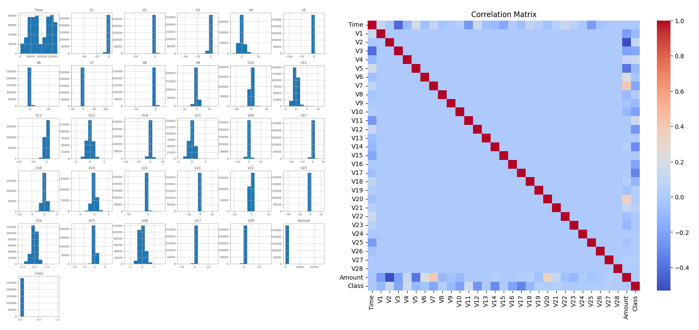

## Selected Projects in Data science, Machine Learning, and Data Visualisation
---
### Machine Learning Models for Detecting Credit Card Fraud
I began by inspecting the dataset ensuring that it was as described (The dataset has a kaggle usability rating of 8.53 which is strong but not perfect). Other than having to keep in mind the expected class imbalance (Non fraud >>> Fraud) the dataset passed the eye test on Excel.
I moved on to exploratory data analysis to retrieve general statistical data and visualisations of the dataset to ensure the data was clean and that no values were missing. I proceeded with a correlation heat map to explore the relationship between features, seeing specifically which features share a correlation, which would indicate redundancy that could lead to affecting the performance of some of the models I wish to test.

After being satisfied with the EDA I split my data into training and testing sets at an 80%:20% ratio (1) and incorporating a standard scaler (an ML technique which improves gradient based models by normalising feature scales so that models converge quicker during training, leading to more stabile and faster computations). (2) 
My first model was a Random Forest model, making use of scikit's RandomForestClassifier, a well optimised tool which is perfect to test this size of dataset without siphoning my computer's memory. After training the model and creating predictions, I calculate the performance metrics and move on to the next model.
A logistic Regression model assumes a linear relationship between input features and the log-odds of a target variable, a simple but computationally efficient model suitable for smaller datasets. 
Logistic regression is considered to be less effective when dealing with imbalanced data as it tends to predict the majority class more often when there's significant imbalance (4). While i'm expecting a weaker performance from using this, it's still worth comparing it's performance metrics for comparisons sake.
My third model is an XGBoost model, which stands for Extreme Gradient Boosting. Considered to be a very strong predictive model as it combines the outputs of many weak learners, sequentially adding trees to correct errors made by previous ones. While strong it is resource heavy.
And finally I decided to develop a Neural Network, in this case I developed a Multilayer perceptron (MLP) Neural Network, It starts with an input layer matching the number of features in the dataset, followed by two hidden layers with 64 and 32 neurons, each using the ReLU activation function to introduce non-linear relationships. These hidden layers help the model learn complex patterns in the data by combining outputs in increasingly sophisticated ways. The final layer has a single neuron with a sigmoid activation function, which outputs a probability between 0 and 1, indicating the likelihood of the input belonging to the positive class. The model learns to make predictions by iteratively adjusting weights and biases to minimise the binary cross-entropy loss using the Adam optimiser, which balances the learning rate throughout the model's training.

All of these models are supervised learning models (where the models are trained on labelled data) Comparing these models with eachother you see clear disparities in their performance based on their performance metrics. 
I'll be creating a part 2 of this project to explore unsupervised learning models, and comparing them with their model performances' with the performance of the SLV model performances.

[View on Kaggle](https://www.kaggle.com/code/tom1123/machine-learning-models-to-detect-fraud)

---
### Retail Trends and KPIs PowerBI Dashboard

I created PowerBI dashboards, making use of DAX queries to identify key performance indicators for the retail sales dataset which I selected, picking out and visualising KPIs that were calculatable from the dataset used. As well as templating the dashboard to allow for easy replication for new data, with a variety of different templates and DAX queries for different KPI selections.

[View on GitHub](https://github.com/GHtjm/Retail-Sales-PowerBI)

---
### Optimising Business Data with SQL Database Manipulation
I utilised SQL queries to transform large datasets, subsequently improving the speed of querying data using a large business based dataset by (Node processing time ranging from (114ms - 380 ms with 225 ms average processing time to 57ms - 211 ms at 114ms average processing time, as the results show). Demonstrating a keen understanding of SQL querying and optimisation.

[View on GitHub](https://github.com/GHtjm/Optimising-Business-Data-with-SQL-Database-Manipulation)
